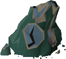
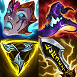



<button type="button" class="project-navigation-button" id="osrsro" style="color: #7253ed; background-color: #f5f6fa; border: 1px solid #eeebee;">OSRS Rainbow Outfits</button>
<button type="button" class="project-navigation-button" id="ssm" style="color: #7253ed; background-color: #f5f6fa; border: 1px solid #eeebee;">Solo Star Miner</button>
<button type="button" class="project-navigation-button" id="svc" style="color: #7253ed; background-color: #f5f6fa; border: 1px solid #eeebee;">SimpleVideoCombiner</button>
<button type="button" class="project-navigation-button" id="lolid" style="color: #7253ed; background-color: #f5f6fa; border: 1px solid #eeebee;">Lol Item Dictionary</button>
<button type="button" class="project-navigation-button" id="tomexlol" style="color: #7253ed; background-color: #f5f6fa; border: 1px solid #eeebee;">Tomexlol.com</button>

Click a project name above to display more info about it.

<b>simplevideocombiner</b> 

Desktop app download: <a href="https://github.com/tomexlol/simplevideocombiner/releases/download/v1.0.0/svc.exe">Windows</a> - <a href="https://github.com/tomexlol/simplevideocombiner/releases/download/v1.0.0-linux/svc">Linux</a> 
Source code: <a href="https://github.com/tomexlol/simplevideocombiner">simplevideocombiner</a> 
 
Edits video clips into a single video file and adds relevant info.  Helps esports coaches prepare videos for their players. 

 
<b>Tech Stack</b>
 
<u>Python</u>:
<a href="https://zulko.github.io/moviepy/">MoviePY</a> is utilized for video editing, while the user interface is designed using <a href="https://doc.qt.io/qt-6/qtdesigner-manual.html">Qt Designer</a> and implemented with <a href="https://wiki.python.org/moin/PyQt">PyQt</a>. Portable executables were packaged using <a href="https://pyinstaller.org/en/stable/">PyInstaller</a>.

<b>osrs-rainbow-outfits</b> 
  

Web app live: <a href="https://www.tomexlol.com/osrsro/">tomexlol.com/osrsro</a>  
Source code: <a href="https://github.com/tomexlol/osrs-rainbow-outfits-frontend">Front</a> - <a href="https://github.com/tomexlol/osrs-rainbow-outfits-backend">Back</a>  

Generates colorful equipment sets for Old School Runescape.
 
 
<b>Tech Stack</b>
 
<u>Python</u>: back-end scripts executed once to populate the item data. Uses <a href="https://pillow.readthedocs.io/en/stable/">PIL</a> to separate Old School Runescape equipment into color categories according to the colors in their icons. This data (plus an object that maps item names to their corresponding item IDs) is provided to the React front-end (currently manually).  
<u>React</u>: front-end web app that allows users to generate equipment sets in their preferred color range and export them to <a href="https://runelite.net/">Runelite</a>'s <a href="https://github.com/equirs/fashionscape-plugin">FashionScape plugin</a>.  

<b>solo-star-miner</b> 

Web app live: <a href="https://www.tomexlol.com/ssm/">tomexlol.com/ssm</a>  
Source code: <a href="https://github.com/tomexlol/solo-star-miner-frontend">Front</a> - <a href="https://github.com/tomexlol/solo-star-miner-backend">Back</a>  

Helps you AFK mine Shooting Stars in peace in Old School Runescape. 
Confused? Context: <a href="https://github.com/tomexlol/solo-star-miner-frontend#context-what-are-shooting-stars-in-old-school-runescape">what are Shooting Stars, what is Star Miners, and why I made solo-star-miner</a>

 
 
<b>Tech Stack</b>
 
<u>Python</u>: back-end API implemented in <a href="https://flask.palletsprojects.com/en/2.2.x/">Flask</a>. Grabs Star data from the Star Miners <a href="http://starsheet.info/">community sheet</a> using the <a href="https://developers.google.com/sheets/api/quickstart/python">Google Sheets API</a> (only once every 5 minutes) and publishes an endpoint of formatted data for the front-end. 
<u>React</u>: front-end web app tailor-made for dodging the Star Miners community and finding solo Stars.   

<b>League of Legends item dictionary</b> 

Live: <a href="https://www.tomexlol.com/lol/glosario">tomexlol.com/lol/glosario</a>  

<b>Tech Stack</b>
 
<u>Python</u>: <a href="assets/images/ddj.png">ddj.py</a> reads through the item data in <a href="https://developer.riotgames.com/docs/lol">Riot's Data Dragon</a> and builds an object that maps item IDs to their respective names. This is ran twice, through spanish and english names.  
<a href="assets/images/fuser.png">fuser.py</a> reads through ddj's output and builds the HTML table. 
<u>JQuery</u>: handles the filtering. This part was shamelessly acquired from <a href="https://www.geeksforgeeks.org/how-to-perform-a-real-time-search-and-filter-on-a-html-table/">GFG</a> before I knew any JavaScript myself.   

<b>Tomexlol.com</b> 

Website live: <a href="https://www.tomexlol.com/">tomexlol.com</a> 
Source code: <a href="https://github.com/tomexlol/tomexlol.github.io">tomexlol.github.io</a>  

<b>Tech Stack</b>
 
<u><a href="https://jekyllrb.com/">Jekyll</a>+ <a href="https://getbootstrap.com/">Bootstrap</a></u>: does black magic so that you can be reading this right now!  
<u><a href="https://github.com/just-the-docs/just-the-docs">Just the Docs</a></u>: makes the black magic look all pretty 
<u><a href="https://pages.github.com/">Github Pages</a></u>: puts the black magic on the internet  

